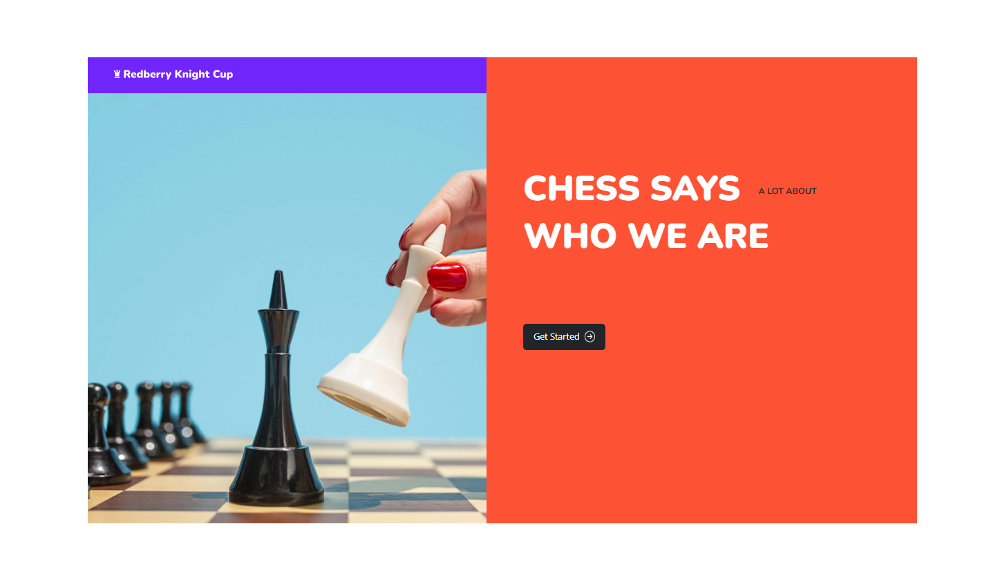

# Redberry Knight Cup

## Overview

### The challenge

Users should be able to:

- View the optimal layout for each page depending on their device's screen size
- See hover states for all interactive elements throughout the site

### Screenshot



### Getting Started

1. First of all you need to clone app repository from github:

```
git clone https://github.com/beqa200/redberry-knight-cup-bitcamp.git
```

2. Next step requires start live server.

### Links

- Solution URL: [Add solution URL here](https://github.com/beqa200/redberry-knight-cup-bitcamp)
- Live Site URL: [Vercel](https://redberry-knight-cup-bitcamp.vercel.app/)

## My process

### Built with

- React
- Axios
- React Hook Form
- React Select
- React Router Dom
- Prime React
- Styled Components

### Useful resources

- [reactor.bitcamp.ge](https://reactor.bitcamp.ge/) -This web-page helped us to dig deeper into ReactJS.
- [developer.mozilla](https://developer.mozilla.org/en-US/) - This is an amazing web-page which gave us in-depth knowledge in JavaScript language. We'd recommend it to anyone still learning this language.
- [stackoverflow](https://stackoverflow.com/) - This is an amazing web-page where you can ask any technical question about speciefic issue and other developers will help you to solve the problem. Their Q&A platform is a great tool to find the right answer for your project. We highly recommend this web-page for other developers.

## Author

- Linkedin - [Beka Merebashvili](https://www.linkedin.com/in/beka-merebashvili/)
- Linkedin - [Levan Parastashvili](https://www.linkedin.com/in/levan-parastashvili)
- Linkedin - [Giorgi Dzneladze](https://www.linkedin.com/in/giorgi-dzneladze/)

## Acknowledgments

We would like to give a big credit to our mentor, [Beqa Maisuradze](https://www.linkedin.com/in/beka-maisuradze-76a730234/) who helped us to solve many issues during this project.
To sum up, our team project gave us a huge experience in mastering ReactJS as well as improving our skills in teamworking. With the huge effort of our team members we made a great project which is a good representation of our skills and understanding of the ReactJS.
In addition to improving our technical knowledge, the team project allowed us to improve our teamwork and problem solving skills. In conclusion, this project significantly enriched our experience in ReactJS which will definitely help us in the future projects.